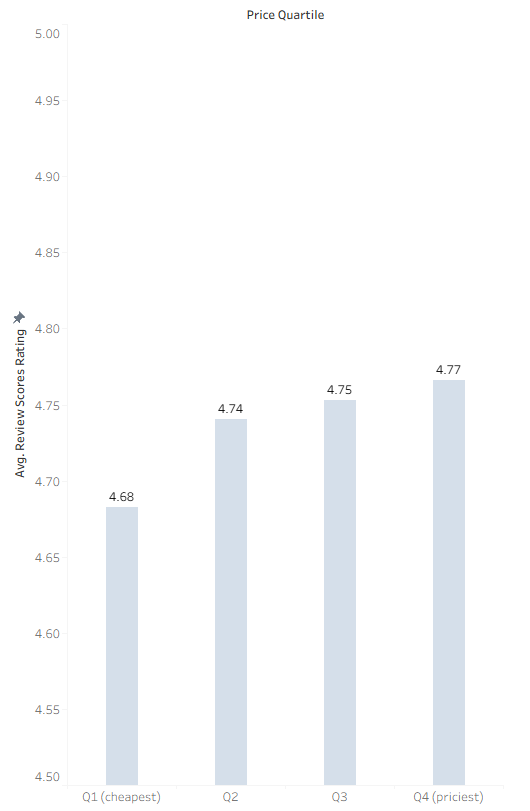
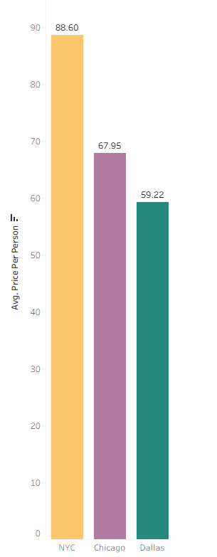
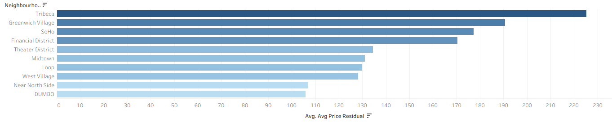
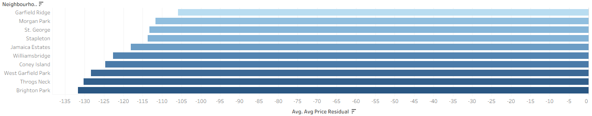
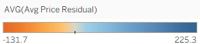
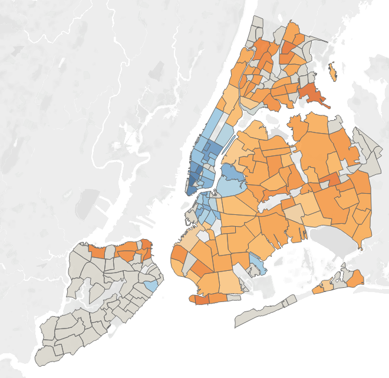
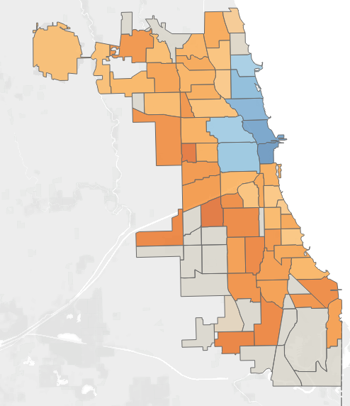
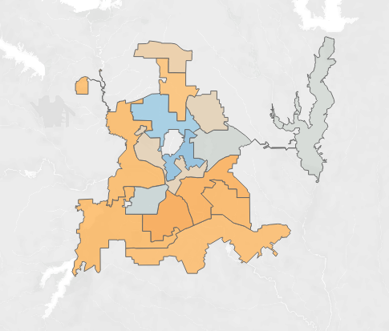
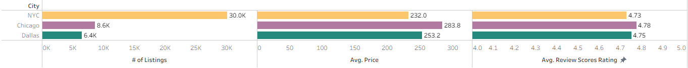

### Airbnb Multi-City Analysis: What Actually Drives Value?

What makes an Airbnb truly worth its price? To find out, I dug into listing, calendar, and review data for Dallas, NYC, and Chicago using Inside Airbnb’s datasets.

#### The Questions
I wanted to look past the marketing and see the math. Does paying more actually make you happier? Which specific amenities justify a price hike? And statistically speaking, which neighborhoods are just charging you for the name?

#### Key Findings
*   **Price is a terrible predictor of happiness.** Across all three cities, the link between price and guest ratings is tiny. Price only explains about 1% of why a guest leaves a good review. In short: you might get a *slightly* better stay by spending more, but it’s rarely a game-changer.
 
*   **The "Premium" Amenities:** Using a regression model, I isolated which features actually drive prices up. A gym adds the biggest premium (+\$68.76/night), followed by a washer, TV, and hot tub. Interestingly, Wifi adds almost zero value—it’s now a baseline expectation, not a luxury.
*   **The Neighborhood Tax:** In famous areas like NYC’s Tribeca or Chicago’s Loop, you aren't paying for better features; you’re paying for the zip code. The best actual value? It’s almost always in outer-borough spots like Throgs Neck or Jamaica Estates that tourists usually overlook.

### Index for Neighbourhoods

### NYC Neighbourhoods

### Chicago Neighbourhoods

### Dallas Neighbourhoods

*   **Dallas Wins on Value:** While satisfaction levels are nearly identical across all three cities, Dallas averages \$54.88 per person, compared to NYC’s \$83.06. You’re essentially paying 50% more in New York for the same level of happiness.

*   **The \$300 Secret:** At the \$300/night mark, "Superhost" status is the biggest indicator of a stay feeling "worth it." It matters way more than any individual physical amenity.

#### The Stack & Pipeline
I built this using **Python (pandas, statsmodels, NLTK)** for the heavy lifting and **PostgreSQL** for the initial data structuring. The pipeline handles everything from cleaning raw price strings to running VADER sentiment analysis on thousands of guest reviews.

## Data Sources

Data is sourced from [Inside Airbnb](http://insideairbnb.com/get-the-data/). Because files like the NYC calendar can exceed 700MB, I haven't included the full datasets in this repo — a small sample of the cleaned data is available in `data/sample/` instead. To reproduce this project, download the raw files into `DataRaw/<City>/` and run the pipeline scripts in order.

- **listings.csv** — one row per listing, with price, room type, amenities, host details, and review scores
- **calendar.csv** — daily availability and pricing status for every listing over a rolling year, used here as a demand proxy
- **reviews.csv** — every individual guest review and its date, used for the sentiment analysis
- **neighbourhoods.geojson** — the geographic boundary shapes for each city's neighborhoods, used to map listings to real neighborhood polygons
  
## A Note on My Process

This project actually began in Postgres with SQL since I wanted to showcase multiple skillsets. Mid-way through, however, I shifted the cleaning and analysis to Python to increase speed and keep the workflow unified. I think it's important to show that data science isn't always a straight line.

## Next Steps

- [ ] Build the Tableau dashboard
- [ ] Write the final summary of results

**Author:** Ben Kim
